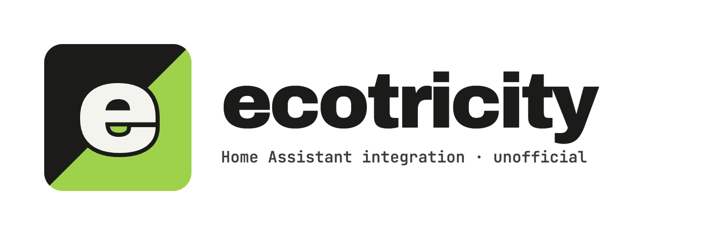

<picture>
  <source media="(prefers-color-scheme: dark)" srcset="custom_components/ecotricity/brand/dark_logo@2x.png">
  
</picture>

# Ecotricity for Home Assistant

Unofficial Home Assistant integration for [Ecotricity](https://www.ecotricity.co.uk/) (UK).
It reads your smart meter data and tariff from the Ecotricity online account
(my.ecotricity.co.uk) and shows them in Home Assistant, including the Energy dashboard.

> This project is not affiliated with or endorsed by Ecotricity. Ecotricity has no
> public API. The integration uses the same calls as the Ecotricity website, so it can
> stop working when Ecotricity changes the website.

## What you get

- **Energy dashboard:** daily electricity usage, with up to 13 months of history on
  first set up.
- **Sensors:**

  | Sensor | Unit | Notes |
  |---|---|---|
  | Meter reading | kWh | The latest meter register value |
  | Last daily consumption | kWh | Usage covered by the latest read |
  | Last reading time | time | When the latest read was taken |
  | Unit rate | GBP/kWh | Use it as the electricity price in the Energy dashboard |
  | Standing charge | GBP/d | The daily standing charge |

## Requirements

- An Ecotricity online account (email address and password) for a supply address with
  a smart meter.
- Home Assistant 2026.2 or newer.

Tested with a single-rate electricity smart meter (credit, not prepay). Gas, Economy 7
and export tariffs are not supported yet.

## Install

### HACS (recommended)

1. In HACS, open the menu (⋮) and select **Custom repositories**.
2. Add `https://github.com/simonsolts/ecotricity-homeassistant` with the type
   **Integration**.
3. Find **Ecotricity** in HACS and select **Download**.
4. Restart Home Assistant.

### Manual

1. Copy `custom_components/ecotricity` into the `custom_components` folder of your Home
   Assistant configuration.
2. Restart Home Assistant.

## Set up

1. Go to **Settings → Devices & services → Add integration** and select
   **Ecotricity**.
2. Enter the email address and password of your Ecotricity online account.
3. If your account has more than one supply address, choose one. To add another
   address, add the integration again.

If you change your Ecotricity password, Home Assistant asks you for the new one.

## Energy dashboard

1. Go to **Settings → Dashboards → Energy**.
2. Under **Electricity grid → Grid consumption**, select **Add consumption**.
3. Select the statistic **Ecotricity electricity &lt;your MPAN&gt;**
   (`ecotricity:electricity_<mpan>`). Do not select the *Meter reading* sensor.
4. For the cost, select **Use an entity with current price** and choose the
   **Unit rate** sensor.

### Why a statistic and not the sensor?

Ecotricity gets one smart meter read per day, at midnight. The read arrives on the
website a few hours later, at about 02:00 to 03:00. If Home Assistant made its history
from the sensor, it would put each day's usage in the wrong hours. The integration
writes the history itself, with the correct time for each read. For this reason, the
*Meter reading* sensor has no state class and does not show in the Energy dashboard.

The data is **daily**. Ecotricity's website has no half-hourly data, so the Energy
dashboard shows each day's usage in one hour, just before midnight.

## How it works

- The integration logs in to my.ecotricity.co.uk every time it starts, and again when
  the session expires.
- It checks for new data every 3 hours.
- On first set up it imports up to 13 months of meter reads. After that, it fetches
  the last 14 days on each check.

## Troubleshooting

- **Debug logs:** add this to `configuration.yaml`:

  ```yaml
  logger:
    logs:
      custom_components.ecotricity: debug
  ```

- **Diagnostics:** on the integration page, select ⋮ → **Download diagnostics**. The
  file does not contain your email address, password, address, account numbers or
  MPAN. Attach it when you open an issue.

## Privacy

Your email address and password are stored in the Home Assistant configuration, like
for other cloud integrations. The integration sends them only to my.ecotricity.co.uk.

## License

Copyright (C) 2026 Simon Solts

This project uses the [GNU Affero General Public License v3.0](LICENSE), with one
additional term under Section 7(b): you must keep the attribution to the author. See
[NOTICE](NOTICE) for the details.
